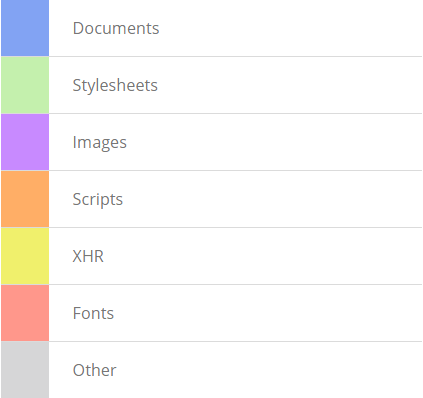

#评估网络性能

网络面板记录了你的应用的每个网络操作的信息，包括详细的时间数据，HTTP请求和响应头，cookies,和WebSocket数据等等，网络面板能够，网络面板能够解答你网页网络性能的各种问题，例如：

* 哪个资源的首字节时间最慢(TTFB)
* 哪些时间花费了最长的时间去加载（持续时间）、
* 谁发起的一个特定的请求
* 对于一个特定的资源时间是怎么花费在不同的网络阶段的。

##关于Resource Timing API

网络面板使用[Resource Timing API](http://www.w3.org/TR/resource-timing),是在加载资源的时候，提供网络时间数据的JavaScript API，例如，这个API可以精确的告诉你一个图片的请求是什么时间开始的，图片的最后一个字节是什么时间被接受的，下面的插图显示了Resource Timing API提供的网络时间数据点。

这个API在任何网页都是可用的，而不仅仅是在开发者工具中，在Chrome中，它是用在全局方法里的，<code>window.performance </code>对象，<code>performance.getEntries()</code>方法返回了一个“资源时间对象”的数组，页面上的每个请求都是在页面上的

想要试试，在当前页面上打开JavaScript控制台，输入下面的提示，然后回车：

    window.performance.getEntries()[0]
    

这个评估了数据时间对象数组里第一个元素，并且在控制台里显示了它的属性

每个时间戳都是微妙，遵循了[High ResolutionTime](http://www.w3.org/TR/hr-time/#sec-high-resolution-time)规范，这个API就像<code>window.performance.now()</code>   方法在[chrome是可用的](http://updates.html5rocks.com/2012/08/When-milliseconds-are-not-enough-performance-now).

##网络面板概括

当开发者工具打开的时候，网络面板会自动记录所有的网络活动。当你第一次打开该面板的时候，它也可能是空的，重新加载页面来记录数据，你只等待网络活动出现在你的应用中。

每个请求资源都被作为排添加到网络列表里，包含了下面列出的条目，有关网络列表，注意下面几点：

* 下面列出的条目并不是默认都可见的，你可以轻易地[显示和隐藏条目](https://developer.chrome.com/devtools/docs/network#adding-and-removing-table-columns)
* 有些条目包含一个主要的区域和一次次要的区域（例如**Time** 和 **Latency**）。当在[大资源行](https://developer.chrome.com/devtools/docs/network#changing-resource-row-sizes)模式下,这两个区域都会被显示出来。当使用小资源行，只有主要的区域会被显示出来。
* 你可以点击条目的头根据条目的值来对列表进行排序。但是[Timeline条目](https://developer.chrome.com/devtools/docs/network#timeline-view)会表现的有点不同：点击它的条目头将会出现一个额外的排序列表。查看 [Waterfall view](https://developer.chrome.com/devtools/docs/network#timeline-view)和[Sorting and filtering](https://developer.chrome.com/devtools/docs/network#sorting-and-filtering)了解更多的详情。

- **Name and Path** 各自的名称和资源的URL路径  

- **Method** 用于请求的HTTP方式。例如：GET 或者 POST.

- **Status and Text** HTTP的状态码和消息文本

- **Domain** 资源请求的域  

- **Type** 请求资源的MIME类型

- **Initiator** 对象或者过程发起的请求，它可以是下面值的其中之一

 + Parser Chrome的HTML解析器发出请求。
 + Redirect 一个HTTP重定向发起请求。
 + Script 一个脚本发起的请求
 + Other 一些其他过程或者动作发起的请求，例如用户通过链接导航到网页，或通过在地址栏中输入URL。

- Cookies 在请求中Cookies转移的数目，当查看资源的细节的时候在[Cookies tab](https://developer.chrome.com/devtools/docs/network#cookies)这些相应的cookies都能看到。

- Set-Cookies 在HTTP请求中cookies设置的数目

- Size and Content Size是响应头（通常为几百个字节）加上响应体的组合大小，在通过服务端发送的时候，Content是资源解码成文本的小大，如果资源是从浏览器中的缓存而不是通过网络加载来的，那么这个区域就包含了(from cache)文本。

- Time and Latency Time是总的持续时间，从接受请求开始到响应接收最后一个字节结束，Latency是在响应过程中到加载第一个字节的时间

- Timeline 时间线条目显示了所有网络请求的瀑布流，单击这个条目的头部将会显示一个额外的排序区域的菜单。

###在导航上保存网络日志

在默认的情况下，当你导航到另外一个页面或者重载当前的页面的时候，当前的网络记录日志是丢弃的，要想保存这些场景中的记录日志，在底部点击**Preserve log upon navigation**按钮，新记录被追加到该表的底部。再次点击相同的按钮（新的是红色的）来禁用日志保存。

###排序和过滤

在默认的情况下，资源是根据在网络列表中每个请求的开始时间来排序的（网络瀑布）。你可以通过点击条目的头根据另外一个值来重新进行排序，再次点击头部来改变排序的次序（升序或者降序）

Timeline条目是有点与众不同的，当我们点击的时候，会显示额外的排序字段的菜单。

这个菜单包含了下面排序的选项:

* Timeline 根据每个网络请求的开始时间来进行排序，这也等同于通过开始时间选项来进行排序。

* Start Time 根据每个网络请求的开始时间来进行排序，这也等同于通过时间线选项来进行排序。  

* Response Time 根据请求的响应时间来进行排序。

* End Time 根据每个请求的完成时间来进行排序。

* Duration 根据每个请求的持续时间来进行排序。

* Latency 根据请求的开始和响应的开始之间的时间（通常知道的是首字节时间）来进行排序。

想要过滤网络列表来显示某一类型的资源，在面板的底部点击其中一个内容类型**Documents**, **Stylesheets**, **Images**, **Scripts**, **XHR**, **Fonts**, **WebSockets**, 和**Other**.在下面的图片里，只有CSS资源显示出来了，想要查看所有的内容类型，点击**All**按钮来过滤。

###高级过滤

除了资源类型的过滤，你也可以通过过滤查询来缩小资源范围，例如，找到所有状态码为200的资源，你可以在过滤输入框里输入<code>StatusCode:200</code>

请注意一下以下行为:*一个过滤查询包含一个**类型**(状态码)和**值**(200)*,一个过滤查询不分区大小写，你能够输入大写或者小写，*过滤类型将会自动补充.使用箭头键来形成一个选择，然后通过按`Tab`来选择*，这个过滤器能够根据显示给你的当前网络的记录值来自动填充，*快速的预览你的查看结果，使用循环的`Up`/`Down`箭头来自动完成填充，结果将会立即呈现出来，即使你不按回车键和tab键*要想否定一个过滤查询，在前面加上一个破折号（-），例如<code>-StatusCode:200</code>

可用的过滤类型:

* domain 资源的URL**域**部分。例如<code>www.google-analytics.com.</code>   

* has-response-header 检查资源中是否有一个响应头，而不用管值，例如<code>Access-Control-Allow-Origin.</code>   

* is 显示在当前时间点上，显示出请求运行情况。当前可用的值：<code>running</code>    

* larger-than 显示出比特定请求大小大的传输请求，假设单位以字节为单位，但是千字节（K）和兆字节（M）为单位也是允许的，例如：<code>larger-than:50, larger-than:150k, larger-than:2m</code>

* method 用于HTTP请求的方式,例如GET

* mime-type 例如大家所知道的<code>Content-type</code> - 资源类型的标识符。例如<code>text/html.</code>

* scheme URL的方案部分,例如<code>https</code>

* set-cookie-name 由服务器设置的cookies名称，例如<code>loggedIn</code>(设想一个cookie<code>loggedIn=true</code>)

* set-cookie-value 由服务器设置的cookies的值。例如<code>true</code>(设想一个cookie<code>loggedIn=true</code>)

* set-cookie-domain 域名的cookie也是由服务器设置的，例如<code>foo.com</code>(设想一个cookie<code>loggedIn=true; Domain=foo.com; Path=/; Expires=Wed, 13 Jan 2021 22:23:01 GMT; HttpOnly</code>)

* status-code 在HTTP响应中的状态代码。例如<code>200</code>

要使用上述列表中显示的查询,构建它的格式为<code> Filter Type:Description </code>,为了确保查询有效，你将几乎总是需要使用自动补充功能。

###添加和完成列表项

您可以更改网络列表中显示的列的默认设置。 要显示或隐藏列，右键+单击或Control+单击(仅限Mac)表头，然后从列表中选择或取消选择列表名。

###改变资源行数目

你可以在大列表行模式下（默认）或者在小列表行下查看网络列表。点击面板底部的蓝色的**Use small resource rows**来切换按钮。点击相同的按钮(现在是灰色的)再次来查看大的列表行。大的行能够使一些条目能够展示出两个文本段，一个主要的区域和一个次要的区域（例如Time和Latency），当使用小行模式来查看的话只有主要的区域是显示出来的。

小的资源行模式下的网络列表，只是显示的时间线条目。

###瀑布视图

在网络面板中瀑布视图用图形形式展现每个资源花费的时间。从 HTTP请求开始到响应接受最后一个字节。

每个资源的装载时间被表示为一个条形.每个资源都对应了一个颜色编码信息每种颜色都指定了接受不同资源的不同步骤，正在变长的大的条形代表了用于请求传输过程中更多的数据。

一个简单页面的网络时间线

将鼠标悬停于条形上，它自己也能展示出完整的时间数据，这与一个给定资源在[Timing details tab](https://developer.chrome.com/devtools/docs/network#resource-network-timing)展示的信息是一样的。

悬停效果下相应的网络时间细节

瀑布流用蓝色和红色的垂直线高亮显示了[DOMContentLoaded](http://docs.webplatform.org/wiki/dom/events/DOMContentLoaded)和[load](http://docs.webplatform.org/wiki/dom/events/load)加载事件。当引擎完成了<code>DOMContentLoaded</code>事件触发的主要文档的解析,接下来检索所有页面资源<code>load</code>事件将会触发。

通过timeline展现出来的事件线。

你可以启用网络设置来查看时间线，时间线是由颜色编码来表现资源类型的不同。如果你的网络时间信息仍然是通过网络时间信息来访问的，瀑布流条形是按照如下的颜色编码的。

###保存和复制网络信息

在网络列表下`Right-clicking` 或者 `Ctrl` + `Click`（仅限Mac）文本将会出现带有几个动作的菜单。鼠标点击其中的一些动作用于资源行(例如[copying HTTP request headers](https://developer.chrome.com/devtools/docs/network#copying_requests_as_curl_commands))，而其他的一些将用于整个网络记录（例如）

下面的菜单操作应用到选定的资源：

* Open Link in New Tab - 打开一个新的选项卡中的资源。 您也可以双击网络表中的资源名称
* Copy Link Address - 复制资源的URL到系统剪贴板。
* Copy Request Headers - 将HTTP请求头到系统剪贴板
* Copy Response Headers  - 制HTTP响应头到系统剪贴板。
* Copy as cURL - 复制网络请求作为一个[cURL](http://curl.haxx.se/)命令字符串到系统剪贴板。详见[Copying requests as cURL commands](https://developer.chrome.com/devtools/docs/network#copying-requests-as-curl-commands)
* Replay XHR -  如果相应的请求是一个XMLHTTPRequest，重新发送原XHR.

###复制请求作为cURL命令

[cURL](http://curl.haxx.se/) 是一个用于HTTP事务的命令行工具。网络面板的**Copy as cURL **命令重新创建一个HTTP请求（包括HTTP头，SSL证书和查询字符串参数)，并且拷贝它们作为一个cURL命令字符串到剪贴板。你然后可以粘贴字符串到一个终端窗口里(在一个带有cURL的终端里)来执行相同的请求。

下面是来自谷歌新闻主页上XHR请求带有cURL命令行的字符串。
    
    curl 'http://news.google.com/news/xhrd=us' -H 'Accept-Encoding: gzip,deflate,:sdch' -H 'Host: news.google.com' -H 'Accept-Language: en-US,en;q=0.8' -H 'User-Agent: Mozilla/5.0 (Macintosh; Intel Mac OS X 10_8_3) AppleWebKit/537.36 (KHTML, like Gecko) Chrome/29.0.1510.0 Safari/537.36' -H 'Accept: */*' -H 'Referer: http://news.google.com/nwshp?hl=en&tab=wn' -H 'Cookie: NID=67=eruHSUtoIQA-HldQn7U7G5meGuvZOcY32ixQktdgU1qSz7StUDIjC_Knit2xEcWRa-e8CuvmADminmn6h2_IRpk9rWgWMdRj4np3-DM_ssgfeshItriiKsiEXJVfra4n; PREF=ID=a38f960566524d92:U=af866b8c07132db6:FF=0:TM=1369068317:LM=1369068321:S=vVkfXySFmOcAom1K' -H 'Connection: keep-alive' --compressed
    
###保存网络数据

你可以从网络记录中保存数据作为一个HAR(HTTP文档)文件，或者复制这个记录作为一个HAR数据结构到你的剪贴板中，一个HAR文件包含了一个能够描述网络瀑布的JSON数据结构，[一些第三方的工具](http://ericduran.github.io/chromeHAR/)能够从HAR文件中重新构建网络瀑布

<strong>保存记录值：</strong>

1. 在网络面板中右击或者Control+点击
2. 在文本出现的菜单上，选择下面其中的一个行为：
    * Copy All as HAR - 在HAR记录值下复制网络记录值到系统剪切板中
    * Save as HAR with Content -  保存所有的网路数据以及每个页面资源到HAR文件。二进制资源,包括图片，编码为Base64的文本。

想要了解更多的信息,[Web Performance Power Tool: HTTP Archive (HAR)](http://www.igvita.com/2012/08/28/web-performance-power-tool-http-archive-har/)

##网络资源细节

当你在网络列表中点击一个资源名称一个选项卡式的窗口将会出现，其中包含了以下其他详细的信息：

* [HTTP请求和响应头](https://developer.chrome.com/devtools/docs/network#http-headers)
* [资源预览](https://developer.chrome.com/devtools/docs/network#resource-previews)
* [HTTP响应](https://developer.chrome.com/devtools/docs/network#http-response)
* [Cookie名称和值](https://developer.chrome.com/devtools/docs/network#cookies)
* [WebSocket消息](https://developer.chrome.com/devtools/docs/network#websocket-frames)
* [网络资源时间](https://developer.chrome.com/devtools/docs/network#resource-network-timing)

###HTTP头

Headers标签显示的是资源的URL请求,HTTP方法，和响应状态码，此外，它还列出了 HTTP响应和请求头和它们的值，以及任何查询字符串参数。你可以通过点击 **View parsed/View source**切换按钮(分别在每个头部的旁边)来分别查看HTTP头部解析和格式，或者他们的源形式，你还可以点击在查询字符串部分的切换按钮**View decoded/View URL encoded**来查看它们的解码或URL编码形式的参数值。

你可以[复制请求和响应头](https://developer.chrome.com/devtools/docs/network#saving-network-data)到你的剪切板。

###资源预览

Preview选项卡显示了一个可用的资源预览，预览的内容是图片和JSON资源，像下图展示的那样

你可以在[Responsetab](https://developer.chrome.com/devtools/docs/network#http-response)上看到未格式化的资源响应。

###HTTP响应

响应选项卡包含了资源未格式化的内容，下面是一个作为响应请求返回的JSON数据的屏幕截图

您还可以查看一些格式的资源类型预览，包括JSON数据结构和图片。

###Cookies

Cookies标签用一张表显示了在所有资源HTTP请求和响应的头部传输的cookie。你也可以清除所有的cookie。

cookie列表包含了以下的条目：

* **Name** cookie的名称
* **Value** cookie的值
* **Domain** cookie的从属
* **Path** cookie来自URL的路径
* **Expires / Max-Age** cookie的到期时间或者max-age属性
* **Size** 以字节单位cookie的大小
* **HTTP** 这表明，该cookie只能在HTTP请求的浏览器中进行设置，并且不能用JavaScript来访问。
* **Secure** 该属性的存在表明该cookie只能通过安全的连接传送

###WebSocket帧

帧选项卡显示了用WebSocket连接发送或接收的消息。这个选项卡只有在资源发起了一个WebSocket连接后才能显示出来，这个表包含了以下几个选项：

* Data 消息负载。如果消息是纯文本，它就显示在这。对于二进制操作码，此字段显示了操作码的名称和代码，以下是支持的操作码：

    * Continuation Frame
    * Continuation Frame
    * Binary Frame
    * Connection Close Frame
    * Ping Frame
    * Pong Frame

* Length 以字节为单位的消息的有效载荷的长度。

* Time 当创建消息时的时间戳

消息是根据其类型用彩色来编码的，即将发出的消息是淡绿色的，即将收到的消息是白色的。

WebSocket操作码是淡黄色的：

错误消息是浅红色的

**关于当前实施的注意事项：**

* 想要去在新的消息到来之前刷新帧列表，点击左侧的资源名称。
* 只有最新的100条WebSocket消息是由帧列表保存的。

###资源网络时间

时间选项卡用图标的形式记录了参与加载资源的各种网络阶段的时间是怎么分配的。当你的鼠标在[瀑布视图](https://developer.chrome.com/devtools/docs/network#timeline-view)上悬停于资源的条形上时也会有相同的数据展示。

https://developer.chrome.com/devtools/docs/network-files/timing.png

* Stalled/Blocking 在请求可以发送之前的时间等待。这个时间是包括用于任何代理协商时间的，此外，这个时间也包括了浏览器已经建立起来的连接到再次可用，遵从Chrome的[最大六次](https://code.google.com/p/chromium/issues/detail?id=12066)TCP连接规则。

* Proxy Negotiation 用于与代理服务器进行协商的时间.

* DNS Lookup 用于DNS查询的时间，页面上的每个新的域名都需要一个完整DNS查询路由

* Initial Connection / Connecting 用于建立连接的时间，包括TCP握手/重试和协商一个SSL。

* SSL 用于一个SSL握手的时间。

* Request Sent / Sending 用于发出网络请求的时间，通常是零点几毫秒。

* Waiting (TTFB) 用于初始响应的等待时间,也被称为首字节时间，这个时间捕获了到服务端的往返时间，包括服务端发送响应的时间。

* Content Download / Downloading 接受一个响应数据的时间。

##额外的资源

要了解更多优化你的应用程序网络性能的信息，请参阅以下资源：

* Use [PageSpeed Insights](https://developers.google.com/speed/pagespeed/insights) to identify performance best practices that can be applied to your site, and [PageSpeed optimization tools](https://developers.google.com/speed/pagespeed/optimization) to automate the process of applying those best practices.
* [High Performance Networking in Google Chrome](http://www.igvita.com/posa/high-performance-networking-in-google-chrome/) discusses Chrome network internals and how you can take advantage of them to make your site faster.
* [How gzip compression works](https://developers.google.com/speed/articles/gzip) provides a high level overview gzip compression and why it's a good idea.
* [Web Performance Best Practices](https://developers.google.com/speed/docs/best-practices/rules_intro) provides additional tips for optimizing the network performance of your web page or application.

