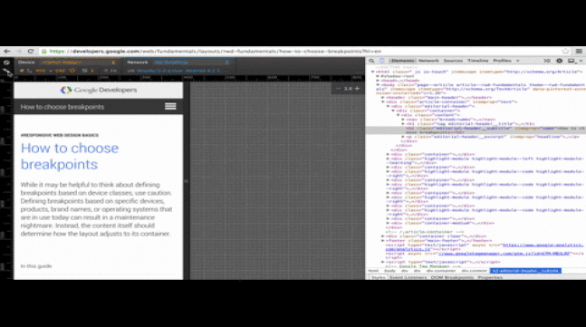

## 设备模式和手机模拟

随着手机用户的增长，网站的响应式实际变得越来越重要，网页内容需要在各种设备上和各种网络信号下体验极好。但是，在手机上测试需要花费更长的时间，调试也变得非常麻烦。

设备模式可以在浏览器中通过模拟真实手机来进行测试。

你可以使用设备模式来做以下工作：

- 通过模拟不同屏幕的尺寸和分辨率，包括 Retina 显示屏来测试你的应用
- 使用网络模拟器，在不影响到浏览器其他窗口的情况下测试你的网站性能
- 可视化和检查 CSS 媒体查询
- 精确模拟触屏事件、地理定位和设备输入
- 将设备模式与 Devtools 结合来简化你的测试流程

 #### 启用设备模式

 点击 Toggle device mode 按钮可以开启设备模式，或者使用快捷键 `Ctrl` + `Shift` + `M`（Mac：`Cmd` + `Shift` + `M`）。

 

 #### 使用屏幕模拟器

 设备模拟器可以帮助你测试网站的响应式，省去了多台设备之间切换的麻烦。

 <strong>使用设备预置</strong>

 设备模式下提供了很多主流设备的模型，在设备下拉列表中选择设备可以快速模拟一个特定的设备。

 

每个设备的预置会自动配置一下功能：

- requess 中的特定 UA
- 设置设备分辨率和像素比
- 启用触摸仿真（如果适用）
- 模拟滚动条覆盖和 meta viewport
- 如果没有定义页面视口，自动调整文本大小

<strong>自定义屏幕</strong>

如果需要自定义屏幕尺寸，可以手动设置设备的宽度和高度的 CSS 像素。

如果你想从普通屏幕调整为 Retina 屏或从 Retina 屏调整为普通屏幕，可以通过Device pixel ratio 调整设备的像素比，该装置是逻辑像素与物理像素之间的比率，配置 Retina 屏，比如 iPhone 设备，需要比普通设备更高的像素密度，这会影响视觉内容的清晰度和尺寸。

网络上常用的 DPR-sensitivity 实例有：

- CSS media queries，如  @media (-webkit-min-device-pixel-ratio: 2), (min-resolution: 192dpi) { ... }
- CSS image-set 规则
- 图片的 srcset 属性
- window.devicePixelRatios 属性

如果你有一个原生的 Retina 显示屏，你会发现，低 dpi 的资源看起来是像素化的，而高 dpi 的资源是清晰的。现在设置 DPR 为 2 ，通过放大视口，2x 的资源看起来还是清晰的，而 1x 的资源看起来就会是像素化的。

#### 模拟网络连接

在不同的网络条件下优化网站性能对于手机用户是非常重要的。

设备模式的网络调节可以让你在不同的网络条件下调试你的网站，包括 Edge、3G，还有离线。从预设的下拉菜单中选择一个网络连接来设定网络节流和延迟操作。

网络节流人为地限制了最大下载吞吐量（数据传输速度），延迟操作强制把连接的延迟降到最低（RTT）。

#### 调试媒体查询

媒体查询是响应式网页的重要组成部分，设备模式让媒体查询易于实现并且方便调试。

点击视图左上角的媒体查询按钮 可以看到媒体查询调试器，Devtools 会检测你的样式中的媒体查询并将它们以彩色的形式显示在上方的标尺中。

媒体查询的代表颜色如下：

：只定义了最大宽度的媒体查询
：定义了宽度在一定范围的媒体查询
：只定义了最小宽度的媒体查询

#### 预览画面风格

点击一个媒体查询栏，可以调整到该媒体查询的屏幕尺寸和模拟器的分辨率，现在就可以预览当前设备的样式了。

#### 查看 CSS

右击一个媒体查询栏可以跳转到定义该媒体查询范围的源代码并查看其中的 CSS 样式。

#### 查看更多媒体查询的样式

媒体查询指定了不同的屏幕指定了不同样式，如果想要预览其他媒体查询类型的样式，如： print，你可以在模拟面板的 media 选项中设置。

点击右上角的 按钮会弹出模拟面板，选择 Media 选项。

勾选 CSS media，现在就可以在下拉框中选择媒体查询类型来预览了。

#### 模拟设备传感器

大部分的台式机都不是触摸屏，GPS芯片和加速传感器，这些在你的开发环境中都很难去测试，设备模式可以模拟移动设备的传感器，减轻了测试的难度。

打开 Devtools 中的 Emulation，选择 Sensors，这样就可以设置传感器控制了。

>注意：如果你的应用程序是使用 JavaScript （如 Modenizr）检测到传感器 onload，那么在启用传感器模拟之后需要刷新页面。

#### 触发触屏事件

勾选 Emulate touch screen 就相当于在模拟器中启用触屏模拟，现在光标放到视图中时会变成一个指尖大小的圆形，并且已经可以触发手机设备的触摸事件了（如 touchstart、touchmove、touchend）。

由于鼠标事件也可以在触屏设备上使用，所有触屏模拟器不会禁用鼠标事件。

#### 模拟多点触摸

你可以在支持多点触摸输入设备（如笔记本的触控板）中模拟多点触摸事件。

#### 模拟地理定位数据

与台式机不一样的是，移动设备通常使用 GPS 硬件来检测位置，在设备模式中可以模拟地理位置坐标来使用 Geolocation API。

勾选  Emulate geolocation coordinates 复选框之后就可以开启地理坐标模拟了。

你可以使用这个模拟器来重写定位数据来覆盖 navigator.geolocation 的值，而且在定位数据不可用的情况下模拟数据。

#### 模拟设备方向

如果你想使用 Orientation API 来测试加速数据，你可以使用 Emulator 中的 accelerometer 来模拟数据。

在 Emulator 面板中勾选 Accelerometer 可以打开模拟数据。

可以设置以下定向参数：

<strong>α</strong>  绕 Z 轴旋转
<strong>β</strong>  从左向右倾斜
<strong>γ</strong>  从前向后倾斜

#### 自定义设备

设备模式提供了模拟设备的扩展方法，在选择列表没有所需设备的情况下，可以自定义设备，做法如下：

1. 打开 Devtools 设置面板
2. 点开 Devices 栏
3. 点击界面下面的 Add custom device 按钮
4. 填写上面出现的表单
5. 点击 Add Device
6. 打开设备模式，现在就可以在选择列表中选择刚才添加的设备了

#### 要求

虽然 Chrome 的设备模式提供了很多非常有用的模拟工具，它也有一定的局限性，目前已知的问题有如下这些：

- 设备硬件
	* GPU 和 CPU 是无法模拟的
- 浏览器界面
	* 系统界面，如地址栏，不会模拟
	* 原生显示效果，如  <select> 元素不会模拟为一个模式列表
	* 一些增强功能，比如 number input 会打开一个数字键盘，可能与实际设备的行为有所不同
- 浏览器功能
	* WebGL 在模拟器中是支持的，但在 iOS7 设备中是不支持的
	* MathML 在 Chrome 中是不支持的，但是在 iOS7中是支持的
	* iOS5 中的缩放 bug 不能模拟
	* CSS 的 line-height 属性在模拟器中能生效，但是在 Opera Mini 中不支持
	* 一些 CSS 规则限制，比如 IE 中的一些限制，都不能模拟
- AppCache
	* 模拟器不会覆盖 AppCache 清单文件中的 UA。

