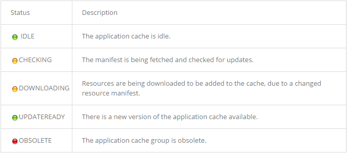

## 管理应用程序存储

Resources 面板允许你检查你的应用程序的本地数据资源，包括 IndexedDB、WebSQL 数据库、local storage 和 session storage、cookies，还有Application Cache resources应用缓存资源。你也可以快速查看你的应用程序的其他资源，包括推按、字体、样式表。

#### IndexedDB

你可以通过一个对象存储的记录查看 IndexedDB 数据库和对象存储、页面，并从一条记录上清除其存储的对象。

- 展开 IndexedDB，可以查看可用数据库的列表
- 从可用数据库列表中选择一个，可以查看此数据库存储的对象

在对象存储巨鹿页面点击上一页和下一页可以翻页查看记录，还可以指定一个 key 来让页面显示以此 key 开始的记录。

使用下面的任意一种方法可以清除对象的记录

- 点击面板下面的清除按钮
- 在对象存储记录鼠标右键或 Ctrl + 单击，在出现的菜单中选择 Clear

#### Web SQL

你可以查看 Web SQL 数据库内容，并且在内容中执行 SQL 命令

- 展开 Web SQL 可以查看可用的 Web SQL 数据库
- 展开数据库的项目树可以查看数据库中可用的表格
- 单击一个表格名称，可以查看表格记录的内容，内容一般显示在右边的面板中
- 点击面板下面的按钮，可以刷新数据库视图

在数据库中运行一个 SQL 命令：

1. 选择包含你想要查询的表格的数据库
2. 在右侧面板中出现的提示里输入 要执行的 SQL 语句

#### Cookies

cookies 资源栏可以查看通过 HTTP header 或 JavaScript 创建的 cookies 的详细信息，你可以清除单个 cookies 或一组同源的 cookies，或者是一个特定的域的所有 cookies。

展开 Cookies 栏，会显示一个主文档的域和加载的 frames 的域列表，选择其中一个来显示这个域下的所有 cookies 和资源及在该组中的所有 frames，这里有两个需要注意的地方：

- 来自不同域的 cookies 可能出现在相同的 frame 组
- 同一个 cookie 可能出现在不同的几个 frame 组中

frame 组中的所有 cookie 都会显示一下字段的信息：

- Name —— cookie 的名字
- Value —— cookie 的值
- Domain —— cookie 所属于的域
- Path —— cookie 所在的路径
- Expires / Maximum Age —— cookie 的过期时间，或最长期限，对于 session cookies 这个字段始终是 "Session"
- Size —— cookie 数据所占的 bytes 大小
- HTTP —— 如果存在，则表示 cookies 只能通过 HTTP 被使用，并且 JavaScript 对其修改是不允许的
- Secure —— 如果存在，则表示 cookie 的通信必须通过加密传输

你可以清除一个 cookie、所选 frame 组中的所有 cookies或同一个指定域下的所有 cookies，如果一个域下的同一个 cookie 出现在两个 frame 组中，删除此域下的所有 cookies 就会影响着两个分组。

使用一下方法可以删除一个 cookie

- 在表格中选中需要删除的 cookie，然后点击面板下面的删除按钮
- 鼠标右键点击 cookie 选择 Delete

使用下面的方法可以删除所选 frame 组中的所有 cookies

- 点击面板线面的清除按钮
- 鼠标右键点击 frame 组，在出现的菜单中选择 Clear
- 在右侧的 cookies 表格中，鼠标右键点击任意 cookie 选择 Clear All

删除一个域中的所有 cookies：

1. 在目标域的表格中鼠标右键点击（或 Ctrl + 单击）一个 cookie
2. 在出现的菜单中选择  Clear All from `domain` ，此处的 domain 即目标域名

关于此操作，有一下注意事项：

- 只有具有完全相同的域名的 cookie 将被删除，自己和顶级域名不受影响 
- 只适用于在 Cookies 表中可见的域

你也可以刷新页面来查看页面中 cookies 的改变

单击 Resources 面板下面的 refresh 按钮可以刷新 cookies 表。

#### Application Cache

你可以检查浏览器根据当前文档中指定的应用程序缓存清单而缓存的资源。你可以查看应用程序缓存的当前状态（idle 或 downloading）以及浏览器的链接状态（online 或 offline）。

缓存资源列表中的资源包含以下属性：

- Resource —— 资源的 URL
- Type —— 缓存资源的类型，可以是以下值：
	* Master —— 资源被添加到缓存中，因为它的缓存清单属性表示这是他的缓存
	* Explicit —— 资源被在应用程序的缓存清单文件中被明确列出
	* Network —— 资源在应用程序缓存清单中被列为网络入口
	* Fallback —— 如果资源不可访问资源作为后备
- Size —— 缓存资源的大小

Resources 面板使用有色图标来显示应用程序缓存的当前状态，一下是可能的情况以及说明：

#### Local and session storage

Local storage 和 session storage 面板允许你查看、编辑、创建或删除这些使用 Web Storage APIs 创建的 Local storage 和 session storage 键值对。

下面任一选项，可以删除一对键值对：

- 在数据表中选中一项，选择下面一个操作：
	1. 点击 Delete 按钮
	2. 按下键盘的 Delete 键
- 鼠标右键点击或 Ctrl + 单击需要操作的项，在在出现的菜单中选择 Delete

新增一个键值对：

1. 在一个空行双击鼠标，输入 key 值
2. 在刚才输入 key 值的行中 Value 栏双击鼠标，输入 Value 值

使用以下方法，可以编辑一个已经存在的键值对：

- 双击想要编辑的行
- 鼠标右键点击想要编辑的行，在出现的菜单中选择 Edit

点击面板下面的刷新按钮可以刷新数据存储列表

#### 检查页面资源

你可以查看你的主文档的所有资源，包括images、scripts、fonts 以及所有引用的 frame，页面资源的最高级是文档的 frame，它包括主文件和其嵌入的 frame。

！[frame resources](../../../images/frame-resources.png)

你可以展开一个 frame 来产看其按照类型组织的资源，展开一个类型来查看此类型的所有资源，点击一个资源，然后到右侧面板查看信息，下面是一个 font 资源的预览：

图片资源预览包含图片的尺寸、文件大小、MIME type 以及图片的 URL

其他一些方法：

- 想要在 Network 面板中打开资源，可以右击或 Ctrl + 单击资源然后在出现的菜单中选择 `Reveal In Resources Panel`，在此菜单中还可以复制资源 URL 到系统剪贴板，然后新开浏览器窗口来打开资源

- 想要查看嵌入的 frame 的框架可以将鼠标悬停在 Resorces 面板中的 frame 资源名称上面：

