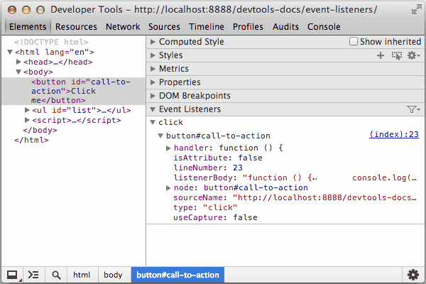
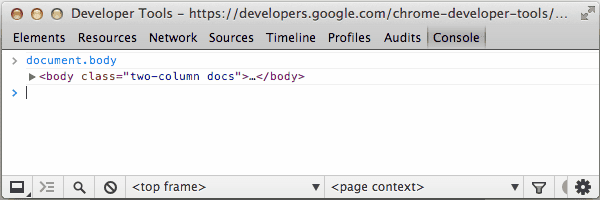
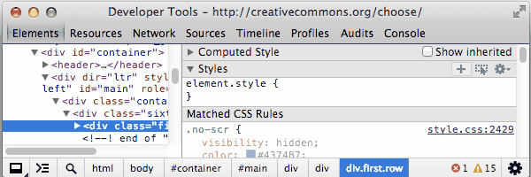
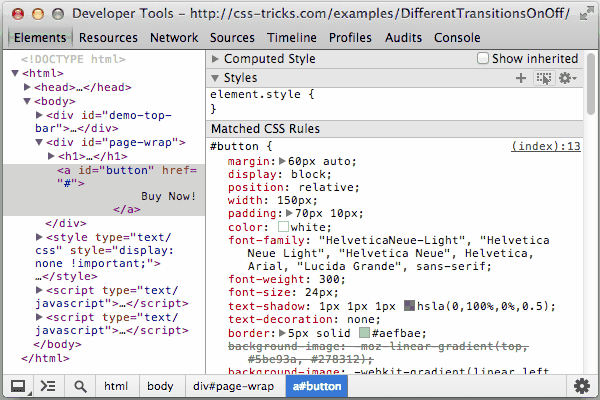
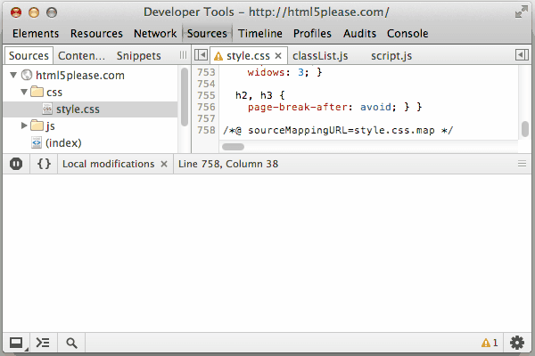
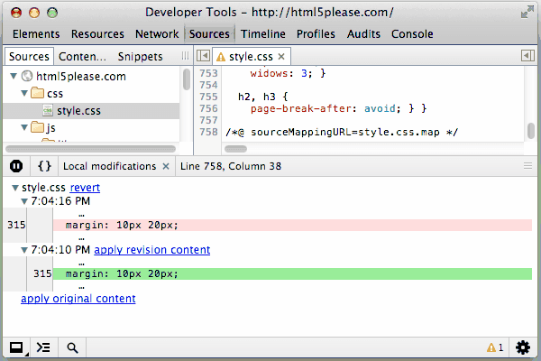
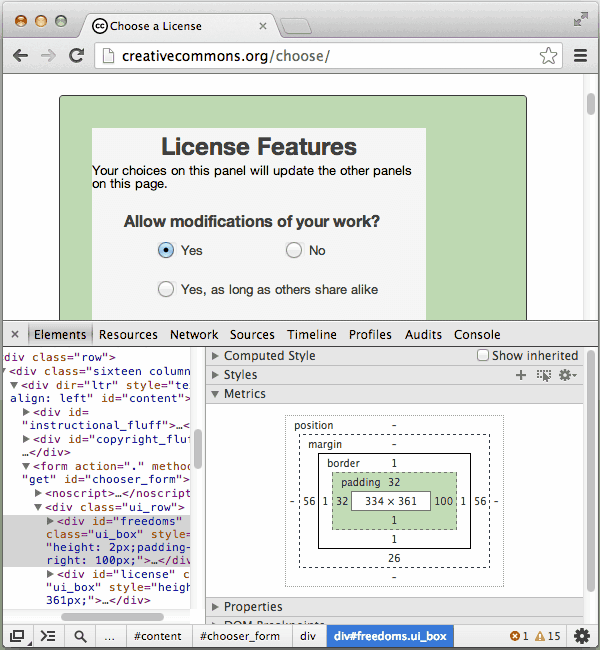

# 样式和DOM编辑器介绍

> 下面内容都是以chrome 37为标准

`Elements`面板可以让你查看当前活动页的结构信息。在当今的应用中，加载HTML文件并初始化，可能跟你最后看到的DOM树不一样。它是一个强大的可以实时表现、调试页面和制作页面的工具。

你可以使用`Elements`面板进行以下任务

- 审查页面中的`HTML`&`CSS`
- 测试不同的布局
- 在线编辑CSS

为了更好的利用屏幕空间，你可以使用下面的一些小技巧。

- *收起*你不用的标签和面板
- *规划和分配*你的DOM树和工具面板区域



## DOM

DOM树显示当前页面的DOM结构。DOM树的每个DOM节点都对应一个HTML元素，诸如`<body>`和`<p>`。为了方便阅读，DOM树视图显示HTML元素标签而不是DOM节点类型，例如`<p>`而不是`HTMLParagraphElement`。

DOM树视图在树上显示当前状态。这可能是与最初加载的HTML不配的原因之一。	

- 你可以用Javascript修改页面
- 浏览器引擎会尝试修改那些不正确的标签并产生一个意料之外的DOM树

### 审查元素

 

检查在显示的DOM节点和CSS中，对应在浏览器中渲染的元素。



这里，有若干种方法审查元素

- 在页面的任意元素右键，点击*审查元素*
- 点击`Ctrl`+ `Shift`+`C`或`Cmd`+`Shift`+`C`(mac)，开打开发者工具，进入审查模式，点击选中的元素。
- 点击*审查元素按钮*
- 在*console*中使用`inspect()`方法，比如`inspect(document.body)`，可以在[Command-Line API](https://developer.chrome.com/devtools/docs/commandline-api.md)中查看`inspect()`的使用方法


### 使用鼠标和键盘来浏览DOM

你能够通过鼠标或者键盘来操作DOM结构

- 展开一个收起的节点，双击这个节点，或者按下方向键`→`
- 收起一个展开的节点，双击这个节点，或者按下方向键`←`

展开一个节点，会再按住`→`会自动的选择第一个子节点，你可以通过反复的按住`→`来展开深度嵌套的结构


当你浏览时，`Elements`面板底部会显示的`面包屑`工具条


当前选中的节点会以蓝色高亮显示，可以点击`面包屑`来浏览


浏览上一级结构，高亮也会移动


开发人员工具尽可能的在`面包屑`中显示更多项


如果单个`项`不能够在`面包屑`工具条上面显示，那么会以`...`显示，单击`...`显示隐藏的元素。

[点击这里查看完整的键盘快捷列表](https://developer.chrome.com/devtools/docs/shortcuts.html)

### 编辑DOM节点和属性

`Elements`面板可以让你修改DOM

- 如同编辑HTML一样编辑DOM
- 添加和删除单个DOM节点
- 编辑属性和值
- 移动DOM元素

更新内存中的DOM树*不*修改源文件。重新加载会删除任意对DOM树的修改。

#### 编辑DOM节点

对于DOM节点，双击可以打开*元素标签*(`h2`, `section`, `img`)。方框内现在处于可编辑可重命名，闭合标签会自动的在修改后更新。


### 编辑属性

对于DOM属性，开发者工具区别属性的名字和值在于点击它们的位置，使它们可编辑。

- 双击属性名字编辑属性名
- 双击属性值编辑它的值部分

当编辑模式被激活，可以按*Tab*循环切换当你切换到最后一个标签，再次按下*Tab*将会创建一个新的属性。

使用*Tab*不是用来添加和编辑属性的唯一方法，因为这是一个常用的模式，也可以在DOM节点上打开内容菜单，添加和编辑属性。


- 选择*Add Attribute* 在打开的标签最后创建一个新的方框
- 选择*Edit Attribute* 修改当前的属性。这个操作会和你之前的操作相关，你可编辑的位置是你点击右键的位置。

### 如同HTML一样编辑DOM节点

如同编辑HTML一样编辑DOM节点和它的子节点

- 右键点击节点，选择*Edit as HTML*（在window下可以点击F2来切换当前节点的编辑模式）

使用可编辑的字段进行修改。

- 点击可编辑字段外更新DOM

点击`Esc`停止编辑，不修改DOM


### 移动元素

你能够在`Elements`面板改变DOM树的顺序来测试不同的布局。

在`Elements`面板拖动节点移动到DOM树上一个新的位置。


### 删除元素

删除元素节点有下面几种方法

- 右键单击节点选择`Delete Node`
- 选择节点并按下*Delete*

你也可以使用*Edit as HTML*删除这个标签内的内容

如果你不小心删除了节点，可以使用`Ctrl`+`Z`(或者`Cmd`+`Z` mac)来撤销你的最后一次行为

### 滚动到视图

当你鼠标悬停或选中节点的时候，选中的元素会在浏览器中高亮显示。如果该元素在屏幕之外，工具条会有一个小提示，所选中的元素不在显示区中。

滚动页面直到元素显示在可视区，*右键*元素选择*Scroll into View*


## 设置DOM断点

DOM断点是一个类似`Sources`面板中的断点。它被用来暂停在一定条件下正在执行中的Javascript。一个Javascript断点跟一个指定的Javascript文件的行相关联，当执行到这一行的时候被触发。DOM断点跟一个指定的DOM元素相关，当DOM元素被一些方法修改的时候被触发。

当你不知道哪个部分的Javascript更新一个给定的元素，你可以使用DOM断点来调试复杂的Javascript应用。

举个例子，如果你的Javascript改变一个DOM元素的样式，你可以在元素的属性被修改的时候设置一个DOM断点。


#### 子树修改

当一个子元素被添加，删除或者移动的时候，可以触发一个子树修改断点，如果你设置了一个子树修改断点在`main-content`元素上，触发代码如下：
```
var element = document.getElementById('main-content');
//修改这个元素的子树
var mySpan = document.createElement('span');
element.appendChild(myspan);
```

#### 属性修改

当元素的属性(`class`,`id`,`name`)动态改变的时候触发属性修改。

```
var element = document.getElementById('main-content');
//修改元素的class属性
element.className = 'active';
```

#### 节点删除

标记的节点从DOM树被删除的时候触发。

```
document.getElementById('main-content').remove();
```

上图的过程，是按照以下步骤

- 修改文本框内容，当内容不为空的时候，A标签添加一个`class="active"`
- 在A标签上添加属性修改断点
- 在执行A标签属性修改代码的时候，触发属性修改断点，并跳转到相关代码
- 鼠标悬停在Javascript的可用变量的时候，显示更多详细信息。

`Elements`和`Sources`面板都含有管理DOM断点的窗口。

所有的DOM断点，可以点击右侧的面板(如果右边窗口太窄了， 会收起来，可以点击右上角的双箭头打开)，每个断点都会带有标示符和断点类型，以列表的形式在面板中显示。


你可以在每个断点的列表项上这样做：

- *鼠标悬停*在元素标识符上，在页面中显示元素的所在位置
- *单击*元素跳转到本地的`Elements`面板
- *切换多选框*启用或停用这个断点

当DOM断点被触发的时候，这个断点会在DOM断点面板高亮显示。`Call Stack`面板会显示调试暂停的原因。


## 查看元素事件监听器

在`Event Listeners`面板查看与DOM节点相关的Javascript事件监听器


`Event Listeners`面板的顶级项显示注册侦听器的事件类型。


点击事件类型扩展箭头能看到注册事件的的处理程序列表。
每个处理程序通过类似CSS选择器的方式识别元素，比如`document`、`button#call-to-action`。如果多个处理程序注册在同一个元素上，那么元素会以列表的形式重复列出。


- *handler*包含回调函数，右键点击*Show Function Definition*查看函数在哪里定义的。
- *isAttribute* 如果这个事件是通过DOM属性注册的，举个栗子`onclick`
- *lineNumber*注册事件的行号
- *listenerBody* 字符串表示的回调函数
- *node* 注册侦听器所在的DOM节点。鼠标悬停在DOM上可以在页面中显示它
- *sourceName* 包含事件侦听器的URL路径
- *type* 事件类型
- *useCapture* 布尔值，代表addEventListener 上的`useCapture`是否设置

默认情况下，已注册的事件处理程序会以以下类型显示：

- 当前选中元素
- 当前选中元素的祖先

如果找到过多的事件处理程序，可以选点击筛选进行筛选，选择`Selected Node Only`只显示当前节点的事件处理程序。


> 很多谷歌扩展程序添加了它们自定义的事件在DOM上

如果你看到一个事件侦听器但是在你的代码中找不到，你可以在匿名窗口中打开你的页面。匿名窗口默认阻止扩展程序运行。

## 样式*Style*

CSS定义页面的表示层。你可以看到和修改任意的CSS声明来控制它们在页面的显示。理解层叠样式表和继承，能够帮助开发和调试的流程。(这一句确实不知道该如何翻译了，希望英语大牛帮翻译。)
> An understanding of the cascade (in Cascading Style Sheets) and inheritance aids a development and debugging workflow

- *级联*(层叠样式表)关系到CSS声明在它们与其他规则重叠的时候如何考虑权重来确定哪些规则该优先考虑
- *继承* HTML元素如何从包含的它元素（祖先节点）里继承CSS属性

查看更多的*级联*和*继承*的相关信息，[点击这里查看W3C文档](http://www.w3.org/TR/CSS2/cascade.html)

### 样式面板

样式面板用来显示被选择元素的CSS规则，按照优先级从高到低的顺序：

- 元素样式直接应用于使用样式属性的元素（或在 DevTools 中应用）
- 显示的 CSS 规则是所匹配的元素的所有规则，如：CSS 中的 span 选择器匹配 HTML 中的 <span> 元素
- 继承的样式包括所选元素的祖先元素的所有可继承样式规则


图片上的标签对应下面编号的选项：

1：匹配所选择的元素的 CSS 选择器
2：级联规则规定，如果两个规则在同一元素上，且具有相同的权重和特性，最后定义的规则优先，这这个例子中，第二个颜色属性优先，第一个颜色属性用删除线显示，表示它的属性被覆盖
3：用户代理样式都有明确的标识，而且往往会被网页上的 CSS 样式覆盖。
4：级联决定了自定义的样式比用户代理的样式权重更高，因此用户定义的样式 `display : inline-block` 覆盖了用户代理定义的样式 `display : block`
5：继承的样式都在 "Inherited from [node]" 标题下显示，单击 DOM 节点中的标题可以定位到其所在 DOM 视图中的位置
6：`:root body` 选择器相比 `body` 选择器具有较高的权重，所以它的样式声明优先
7：`body` 上的 `font-family` 和 `font-size` 属性被覆盖，是由于选择器的权重的原因

逗号选择器的颜色不同，主要取决于它们是否匹配所选择的节点


灰色的选择器（像上面的 audio 和 video）不匹配所选择的节点，上面所示的规则对应下面的 CSS 源：

```css
video, audio, div, .message, body *, time {
  /* visibility: hidden */
  margin-top: 10px;
}
```
由于 visibility 属性被注释，所有样式面板中显示它被禁用

使用快捷键 `Ctrl` + 鼠标左键（Mac：`Cmd` + 鼠标左键）点击样式面板中的 CSS 属性或属性值可以从样式面板跳转到其所在源文件的源代码位置。

#### 编辑与新建样式

你可以在 `Elements` 面板的样式面板中新增或编辑样式，除了灰色的样式信息区域（如用户代理的样式），所有的样式都可以编辑，编辑方式如下：

- 编辑一个已经存在的属性名或值
- 新增一条属性声明
- 添加一个新的 CSS 规则

点击样式旁边的复选框可以选择启用或禁用样式声明。

#### 编辑现有的属性名或值

点击属性名称可以编辑：


点击属性值可以编辑属性值，如果正在编辑一天属性名，可以按 Tab 键或 Enter 键来编辑属性值


默认情况下， CSS 修改只是临时的，当重新加载页面是都将会丢失，想要自定义行为，[参阅 Workspace]()。

当编辑的 CSS 是数值时，可以使用下面的快捷方式来编辑 CSS 属性值：

- 每按一次 ↑ 或 ↓ 键，数值都会增加或减少 1
- 每按一次  `Ctrl` + ↑ 或 `Ctrl` + ↓ ，数值都会增加或减少 0.1
- 每按一次 `Shift` + ↑ / ↓ 或 `PageUp` / `PageDwon` ，数值都会增加或减少 10
- 每按一次 `Shift` + `PageUp` 或 `Shift` + `PageDown` 数值都会增加或减少 100

#### 使用颜色选择器

在样式面板中，你可以使用样色选择器来设置一个在样式面板中已经存在的颜色。


#### 添加一个新的属性

在可编辑的 CSS 样式的空白区域点击可以创建新的样式，现在就可以输入一个新的属性。

添加新的属性时，查看代码提示，请按照下列步骤操作：

- 开始输入 CSS 属性字段时，会出现一个提示下拉框
- 按 ↓ 或 ↑ 可以选择一条属性
- 选择完成后按下 `Tab` 键或 `Enter` 键 

当选择一个有效属性名之后，会弹出可用的属性值，选择需要的使用的属性值的字段，如选择 `display` 属性后会提示 `block`、`flex`、`none`等。

使用 `Ctrl` + V （Mac: `Cmd` + V）, 可以粘贴属性到样式面板。

#### 增加一条样式规则

现在最好能够添加一个新的选择器样式，单击样式面板右上角的加号可以新增一条 CSS 规则。



#### 激活元素伪类

如果你使用了伪类选择器来为 UI 元素提供动态样式，比如 `:hover` ，DevTools 可以手动对每个元素伪类设置样式。



你可以触发一下的四个伪类：

- :active - 激活状态的样式
- :hover - 鼠标悬停时的样式
- :focus - 获得焦点时的样式
- :visited - 访问之后的链接的属性

设置元素的状态：

- 点击显示伪类标签的按钮，然后点击加号新增样式规则
- 在 DOM 节点上右击鼠标，选择 Force Element State 来查看伪类样式

#### 更改历史记录（本地修改）

本地修改包含对源文件（如 JavaScript 或 CSS）的独立修改。

可以使用以下方法来打开本地修改面板。

- 打开 Source 面板
- 在侧边栏的源文件名上右击鼠标（在 Mac 中可以使用 Cmd+ 鼠标左键）
- 选择 Local modifications 选项



可以在 Source 面板中的编辑器编辑源代码来创建修改。

对外部的样式表做一个 CSS 规则的修改，到本地修改面板查看修改。

注意：当使用样式面板右上角的加号来添加样式时，新增的样式不属于任何现有的 CSS 文件，DevTools 会将其添加到 inspector stylesheet 中，这个样式表也可以像其他文件一样在 Source 面板中找到并编辑。

探索本地修改面板：

- 展开顶层文件名可以看到每次修改发生的时间节点
- 展开二级选项可以查看更改前后的变化，红色背景的样式都是被删除的样式，绿色背景的样式是新增样式
- 选择文件名旁边的 revert 会撤销针对该文件的所有本地修改



在 Elements 面板中，可以使用 Ctrl + Z （Mac：Cmd + Z）来快速撤销一些小的更改。

#### 度量面板

度量面板提供一个可视化视图，显示样式如何影响 CSS 盒子模型。



度量面板显示了一套用矩形代表的 CSS 盒子模型，里层的矩形代表 content box ，即内容区域的大小；外框，如 border box 显示每个 border 的值：border-top、border-right、border-bottom、border-left。

如果一个给定的边没有设置值，那么会用一个连字符来显示边框的宽度。

注意：如果在 CSS 中给 position 属性设置了 static 意以外的值，那么度量面板会显示一个带有 position 标记的盒子模型。

可能显示的框（从外到里）：

- positon
- margin
- border
- padding
- Content box （没有标签，即最里层的框）

使用这些方法来使用度量面板：

- 鼠标悬停在盒子模型的一个框上，浏览器中对应的位置会高亮
- 在盒子模型中的一个框中编辑数字，变化会反映在 element.style 部分